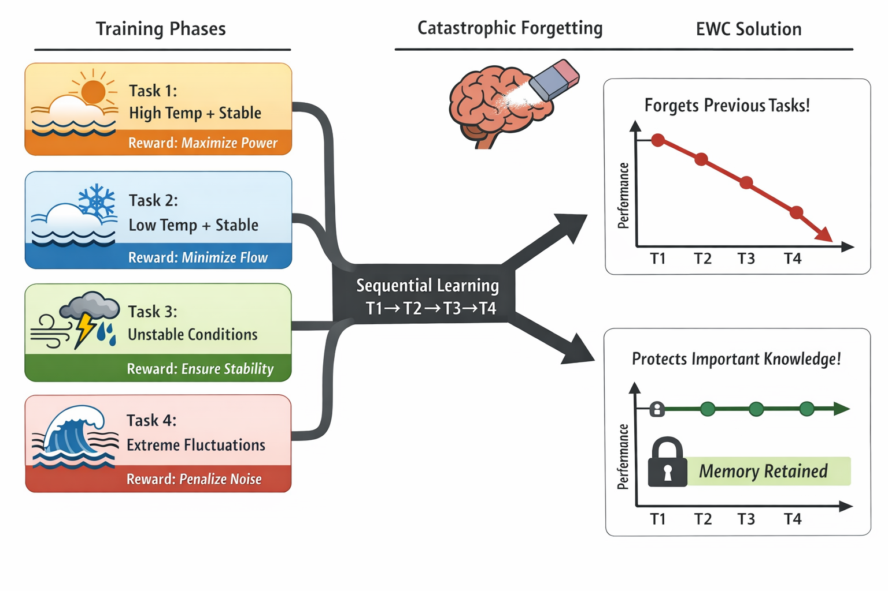
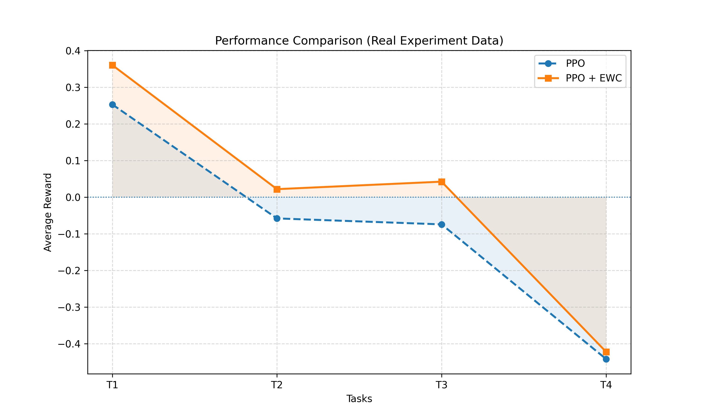

# 🌊 Continual Reinforcement Learning for Adaptive OTEC Control

---

## 🚀 Project Overview

This project explores how **Artificial Intelligence can adapt to real-world environmental changes** in energy systems.

We focus on **Ocean Thermal Energy Conversion (OTEC)** — a renewable energy technology that depends heavily on ocean temperature conditions. Since sea surface temperature (SST) changes over time, designing a controller that works reliably across all conditions becomes a challenging problem.

To address this, we apply **Continual Reinforcement Learning**, where an agent learns sequentially across different environmental conditions while retaining previously learned knowledge.

---

## 🧠 Why This Project Matters

Most control systems and machine learning models assume **stable environments**.

But in reality:

* Ocean temperatures change seasonally
* Climate conditions introduce noise and fluctuations
* Systems must adapt continuously

This creates a **non-stationary learning problem**, where models often suffer from:

> ❗ **Catastrophic Forgetting** — learning new conditions causes the model to forget old ones

This project investigates how to overcome this limitation using modern AI techniques.

---

## ⚙️ What I Built

I designed a **continual learning pipeline** using reinforcement learning:

### 🔹 Algorithms Used

* Proximal Policy Optimization (**PPO**) — baseline RL algorithm
* PPO + Elastic Weight Consolidation (**EWC**) — to reduce forgetting

---

### 🔹 Real-World Dataset

* Used **Sea Surface Temperature (SST)** data
* Stored in **NetCDF format** (climate data standard)
* Created realistic ocean conditions

---
---

## 🧪 Methodology

The proposed system follows a structured continual reinforcement learning pipeline designed to model real-world non-stationary behavior in Ocean Thermal Energy Conversion (OTEC) systems.

### 🔹 Overall Workflow



---

### 🔍 Explanation of the Pipeline

#### 1. Multi-Regime Environment Design

The environment is divided into four distinct thermal regimes, each representing different operating conditions:

* **T1:** High temperature, stable → baseline learning
* **T2:** Low temperature, stable → shifted thermal profile
* **T3:** Unstable conditions → dynamic variations
* **T4:** Extreme fluctuations → noisy and chaotic behavior

Each regime behaves as a **distinct Markov Decision Process (MDP)**, forcing the agent to adapt.

---

#### 2. Task-Specific Reward Engineering

To intentionally create learning conflicts and expose catastrophic forgetting:

* **T1 → Maximize power output**
* **T2 → Minimize flow rate**
* **T3 → Maintain operational stability**
* **T4 → Penalize noise and fluctuations**

This ensures that a single policy cannot perform optimally across all tasks.

---

#### 3. Sequential Learning Setup

The agent is trained sequentially across tasks:

T1 → T2 → T3 → T4

This setup mimics real-world environments where conditions evolve over time, rather than remaining static.

---

#### 4. Catastrophic Forgetting in PPO

When using standard PPO:

* The model adapts to new tasks effectively
* However, it overwrites previously learned knowledge

This leads to a **decline in performance on earlier tasks**, clearly demonstrating catastrophic forgetting.

---

#### 5. EWC-Based Knowledge Retention

To address forgetting, Elastic Weight Consolidation (EWC) is introduced:

* Identifies important parameters from previous tasks
* Applies a penalty to prevent large updates to those parameters
* Preserves previously learned knowledge

This introduces a **stability–plasticity trade-off**, balancing:

* Learning new tasks (**plasticity**)
* Retaining old knowledge (**stability**)

---

#### 6. Evaluation Strategy

After completing training:

* The model is evaluated on all tasks (T1–T4)
* Performance is compared between:

  * PPO (baseline)
  * PPO + EWC (proposed method)

---

### 🎯 Key Outcome

* PPO shows significant performance degradation on earlier tasks
* PPO + EWC maintains more consistent performance across all regimes

👉 Demonstrating effective mitigation of catastrophic forgetting in non-stationary environments

---

### 🔹 Environment Design

The system is modeled as a reinforcement learning environment where:

* **State:** Statistical representation of SST
* **Action:** Control variables (flow, pressure, etc.)
* **Reward:** Task-specific objective

---

## 🌍 Task Design (Core Idea)

Instead of training on one condition, I created **4 distinct regimes**:

| Task | Environment          | Objective          |
| ---- | -------------------- | ------------------ |
| T1   | High temp + stable   | Maximize power     |
| T2   | Low temp + stable    | Minimize flow      |
| T3   | Unstable conditions  | Maintain stability |
| T4   | Extreme fluctuations | Robust control     |

👉 Each task has **different objectives**, forcing the model to adapt.

---

## 🔄 Learning Setup

The agent is trained **sequentially**:

```text
T1 → T2 → T3 → T4
```

This creates:

* Changing environments
* Conflicting objectives

👉 Perfect setup to observe catastrophic forgetting

---

## 📊 Results

| Task | PPO    | PPO + EWC |
| ---- | ------ | --------- |
| T1   | 0.253  | 0.360     |
| T2   | -0.058 | 0.021     |
| T3   | -0.074 | 0.042     |
| T4   | -0.442 | -0.422    |

### 🔍 Key Insight

* PPO forgets earlier tasks
* PPO + EWC **retains knowledge and adapts better**

👉 Demonstrates effective mitigation of catastrophic forgetting

---

## 📈 Visualization



---

## 🧠 Key Concepts Demonstrated

* Continual Learning
* Catastrophic Forgetting
* Stability–Plasticity Trade-off
* Reinforcement Learning in Non-Stationary Environments

---

## 🛠 How to Run

```bash
pip install -r requirements.txt
python experiments/train_ppo_sequential.py
python experiments/train_ppo_ewc.py
python experiments/plot_results_from_file.py
```

---

## 📁 Project Structure

```
otec-continual-rl/
├── src/              # Core environment & data processing
├── experiments/      # Training and evaluation scripts
├── results/          # Output results and plots
├── data/             # SST datasets (not included)
```

---

## 🚀 What I Learned

This project helped me understand:

* How AI systems behave in **dynamic real-world environments**
* Why **model memory and retention** are critical
* How to design **conflicting tasks to test learning robustness**
* Practical implementation of **continual reinforcement learning**

---

## 👤 Author

**Vamsi Krishna Gondu**

AI Research Aspirant

B.Tech Computer Science and Engineering, Specialized in Artificial Intelligence & Intelligent Process Automation

KL University, India


---
## License

This project is released under the MIT License, allowing open use and modification with proper attribution.
